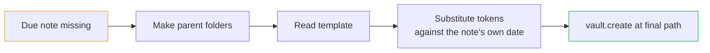

<h1 align="center">📔 Periodic Journal</h1>

<p align="center">
  One plugin for every recurring note.<br>
  There are no fixed granularities — there is a <em>list of note types</em>.
</p>

<p align="center">
  
  
  
  
  
</p>

---

Replaces the **core Daily Notes plugin** and **Periodic Notes** together, and takes over any recurring note a Templater folder rule was creating.

## Why it exists

Periodic Notes models the world as five fixed granularities — daily, weekly, monthly, quarterly, yearly — with one set of settings each.

**That model has no room for a _second_ daily note.** Split your journal into work and personal and one of them has no automation at all. Keep a mood tracker, a habit log, a gratitude page — each is a daily note by every meaningful definition, and none of them is *the* daily note.

The result is a familiar mess: two plugins, a Templater folder rule, and at least one thing you still create by hand every morning.

| Note | Typically created by | Problem |
|---|---|---|
| Daily note | core Daily Notes | A second plugin doing one granularity |
| Weekly / monthly / quarterly / yearly | Periodic Notes | On demand only, rarely automatic |
| A second daily note | nothing | By hand, from a template, every day |
| A tracker with its own folder | a Templater folder rule | Created at the vault root and moved, or created twice |

This plugin replaces the fixed granularities with a **list of note types**. Each type carries its own granularity, path format, template and auto-create flag, **so every note is the same kind of object and nothing is privileged.** Adding an eighth recurring note is a settings action, not a release.

## How a note type works

Each entry in `data.json` looks like this:

```json
{
  "id": "mood-tracker",
  "name": "Mood tracker",
  "granularity": "day",
  "format": "[Health/Mood]/[Mood — ]YYYY-MM-DD",
  "template": "Templates/Mood.md",
  "enabled": true,
  "autoCreate": true
}
```

- **`format`** is a moment.js pattern describing the **whole vault-relative path** without the extension, square brackets being literal. This is deliberately the same convention the core Daily Notes plugin and Periodic Notes already use, **so every format string you already have carries over verbatim** and resolves to the files that already exist. Migrating costs nothing and moves nothing.
- **`granularity`** decides which date the note belongs to (`moment().startOf(unit)`) and what next/previous step through. One of `day`, `week`, `month`, `quarter`, `year`.
- **`autoCreate`** includes the type in the startup sweep and the date-rollover sweep.

## Creation is one step

A recurring note tends to go wrong when creating it and filling in its template are two separate steps in two separate places. Here they're one:



The file is never created anywhere but its final path, and it is never empty at any point. There is nothing to move afterwards.

## Template tokens

The vocabulary matches the core Templates plugin, because that is what your templates are already written against — adopting a new syntax would mean rewriting every template in the vault to install one plugin.

**Substitution runs against the note's own date, not the wall clock.** Creating Monday's note on Tuesday happens every time a machine is asleep at midnight, and every time you backfill; a `{{date}}` meaning *now* would stamp the wrong day into the file, invisibly.

| Token | Result for a 2026-08-19 note |
|---|---|
| `{{title}}` | `26819-daily` |
| `{{date}}` | `2026-08-19` |
| `{{date:YYMDD}}` | `26819` |
| `{{time}}` / `{{time:HH:mm}}` | wall clock at creation |
| `{{yesterday}}` | `2026-08-18` |
| `{{tomorrow:YYMDD}}` | `26820` |
| `{{date-1w:gggg-[W]ww}}` | `2026-W33` |

Offsets accept `d`, `w`, `M`, `Q`, `y`. Anything that is not one of these tokens is left untouched — Dataview inline expressions and stray braces pass through unharmed.

## Automation

- **On startup**, after a configurable delay (default 3s, to let a sync service settle before deciding a note is missing).
- **On date rollover**, checked once a minute, so leaving Obsidian open overnight still produces the next day's notes.
- **On demand**, via *Create all due notes now* in the command palette or the settings tab.

All three run the same sweep, which is idempotent: an existing file is never touched, and a create that loses a race to a sync service falls back to the file that won.

## Commands

| Command | Notes |
|---|---|
| Open current *&lt;type&gt;* | One per enabled type |
| Create all due notes now | The full sweep, manually |
| Next note of this kind | Steps by the active note's own granularity |
| Previous note of this kind | As above |

Next/previous identify the active note by generating candidate paths around today and comparing, because a moment format string is one-way and cannot be parsed back. The search is bounded (±400 days, ±60 weeks, ±15 months, ±6 quarters, ±3 years) and only ever runs when the command is invoked.

## Gotchas

- **This plugin must be the only thing creating these notes.** If the core Daily Notes plugin, Periodic Notes, or a Templater folder template still covers the same ground, two things write the same file and the result looks like a bug in here. The settings tab detects all three and says so at the top; a notice also fires on startup.
- **Templater is the subtle one.** A folder template on a folder this plugin writes into fires on file *creation*, so it inserts its template a **second** time — and unsubstituted, since Templater does not process `{{date:…}}` syntax. The note reads as corrupted rather than as duplicated. If your tracker previously worked, it may only be because the note was created at the vault root and *moved*, which is not a creation event. Remove the rule.
- **A deleted note comes back.** The sweep only asks whether the current note exists, so deleting today's note and restarting Obsidian recreates it. That is what *automatic* means, but it surprises once. Turn off *Create automatically* for a type you want to opt into by hand.
- **A missing template creates an empty note and says so**, rather than refusing. Losing today's note because a template moved is the worse failure; an empty note is visible and one paste away from correct.
- **A new note type ships disabled.** It appears in the list with *Enabled* off, because a type that started writing into a folder you had not chosen yet would be the wrong first impression.
- **`autoCreate` is not inherited on upgrade.** A type written by an older version gets `autoCreate: false` when a field is missing, even where a shipped default says otherwise — picking up a new *writing* behaviour silently is not something to do to somebody's vault.

## Install

```bash
git clone https://github.com/kingletas/obsidian-periodic-journal && cd obsidian-periodic-journal && npm ci && npm run build
```

```bash
cp main.js manifest.json styles.css "$YOUR_VAULT/.obsidian/plugins/periodic-journal/"
```

Then enable it in **Settings → Community plugins**. Do the enabling through Obsidian's own UI rather than by editing `community-plugins.json`: the running app rewrites that file from memory when it exits.

## First run

1. **Turn off whatever was doing this before.** The settings tab detects the core Daily Notes plugin, Periodic Notes and a clashing Templater folder rule, and names each at the top. Two things writing one file looks exactly like a bug in here.
2. **Point the default types at your own folders**, and set their templates. The shipped defaults are generic on purpose — a folder name shipped to every install is a tree somebody did not ask for, and this plugin *writes*.
3. **Add the types the old model had no room for.** A second daily note, a tracker, a habit log. That is the whole reason this exists.

## Development

```bash
npm ci
npm run dev      # esbuild watch
npm test         # bundle, type-check, and run 51 assertions across five suites
npm run build    # tsc -noEmit, then a production bundle
```

The suite `require()`s an esbuild bundle rather than the TypeScript sources, because the bundle is the only thing Obsidian ever loads. `moment` is deliberately **not** stubbed as a working clock: the plugin gets its moment from Obsidian at runtime, so a test pulling its own copy in would be testing a different library than the one that ships. Anything needing a date takes an injected one instead.

[`CONTRIBUTING.md`](CONTRIBUTING.md) covers the rest. [`docs/architecture.md`](docs/architecture.md) explains how the pieces fit together. [`SECURITY.md`](SECURITY.md) covers vulnerability reports — **read it before enabling auto-create**, because this plugin writes files on a schedule.

## License

[MIT](LICENSE) © Luis Tineo
